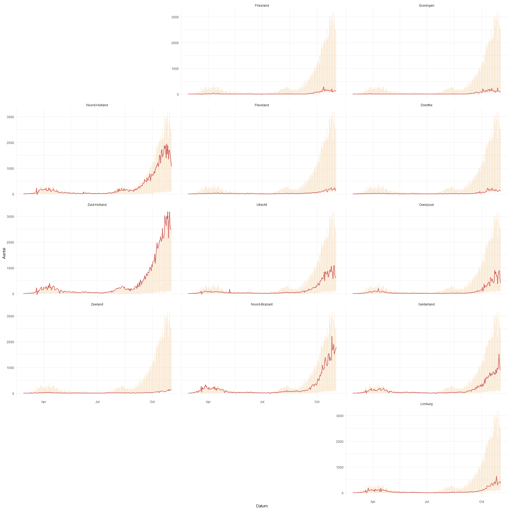
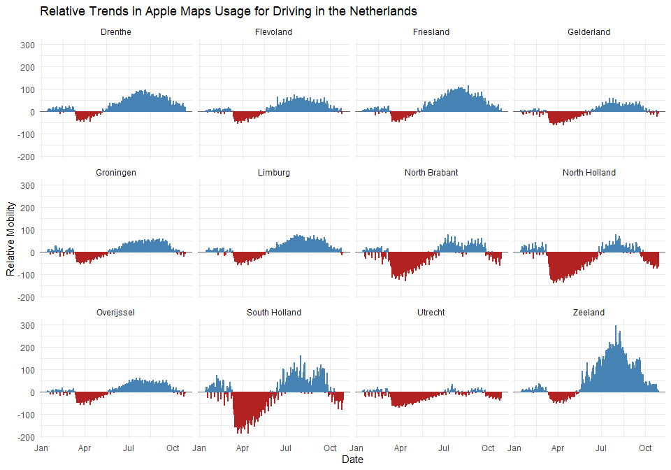

<!-- README.md is generated from README.Rmd. Please edit that file -->

# CoronaWatchNL

<!-- badges: start -->

[](https://www.tidyverse.org/lifecycle/#experimental)
[](https://CRAN.R-project.org/package=CoronaWatchNL)
<!-- badges: end --> CoronaWatchNL is an R package that allows you to
access a wide range of Covid-19 related datasets in the Netherlands.
This package is heavily based on the
[CoronaWatchNL](https://github.com/J535D165/CoronaWatchNL) repository on
GitHub, which collects and releases this information on a daily basis.
However, the R package also provides more datasets that are not included
in the original repository, such as [the weekly mortality rate
data](https://www.cbs.nl/en-gb/series/mortality-per-week) published by
CBS.

## Installation

You can install the development version of CoronaWatchNL from
[GitHub](https://github.com/) with:

``` r
# install.packages("devtools")
devtools::install_github("mcnakhaee/CoronaWatchNL")
```

## Usage

At the moment, the following category of datasets are available via this
R package:

### Geographical datasets

| Dataset                                             | Source | Variables                                                                                                | Function                                                                             |
| --------------------------------------------------- | ------ | -------------------------------------------------------------------------------------------------------- | ------------------------------------------------------------------------------------ |
| Reported case counts by date in NL                  | RIVM   | Date, Type (Total, hospitalized and deceased COVID-19 cases), (Cumulative) Count                         | `get_daily_national_cases()`                                                         |
| Reported case counts by date in NL per province     | RIVM   | Date, Province, Type (Total, hospitalized and deceased COVID-19 cases), (Cumulative) Count               | `get_daily_provincial_cases()`                                                       |
| Reported case counts by date in NL per municipality | RIVM   | Date, Municipality, Province, Type (Total, hospitalized and deceased COVID-19 cases), (Cumulative) Count | `get_daily_cases_per_municipality()`,`get_cumilative_cases_per_municipality()`\#\#\# |

### Descriptive datasets

| Dataset                                          | Source | Variables                                                                                   | Function                          |
| ------------------------------------------------ | ------ | ------------------------------------------------------------------------------------------- | --------------------------------- |
| Case counts in NL per age                        | RIVM   | Date, Age group, Type (Total, hospitalized and deceased COVID-19 cases), (Cumulative) Count | `get_cases_by_age()`              |
| Case counts in NL per sex                        | RIVM   | Date, Sex, Type (Total, hospitalized and deceased COVID-19 cases), (Cumulative) Count       | `get_cases_by_sex()`              |
| Deceased case counts in NL per sex and age group | RIVM   | Date, Age group, Sex, (Cumulative) Count of deceased cases                                  | `get_deceased_cases_by_sex_age()` |

### Intensive care datasets

| Dataset                                                                | Source         | Variables                                                                                                                                                                | Function                                     |
| ---------------------------------------------------------------------- | -------------- | ------------------------------------------------------------------------------------------------------------------------------------------------------------------------ | -------------------------------------------- |
| COVID-19 intensive care patient counts in NL (Wide or long Format)     | Stichting NICE | Date, New, Total and Cumulative ICU admissions per day, Number of ICUs with at least one COVID-19 case, New and Cumulative fatal, survived and discharged ICU admissions | `get_icu_data_wide()`/ `get_icu_data_long`() |
| COVID-19 intensive care patient counts with country of hospitalization | LCPS           | Date, Country of Hospitalization, Total COVID-19 ICU admissions                                                                                                          | `get_lcps_data()`                            |

### Mobility data

| Dataset                       | Source                                                         | Variables | Function                                                                       |
| ----------------------------- | -------------------------------------------------------------- | --------- | ------------------------------------------------------------------------------ |
| Apple’s daily mobility report | [GitHub](https://github.com/ActiveConclusion/COVID19_mobility) |           | `get_apple_mobility_data()`                                                    |
| Google’s mobility report      | [GitHub](https://github.com/ActiveConclusion/COVID19_mobility) |           | `get_google_mobility_data()`                                                   |
| Waze’s mobility report        | [GitHub](https://github.com/ActiveConclusion/COVID19_mobility) |           | `get_waze_mobility_city_level_data()`,`get_waze_mobility_country_level_data()` |

### Mortality Rate

| Dataset               | Source                                                                                       | Variables                                                                                  | Function               |
| --------------------- | -------------------------------------------------------------------------------------------- | ------------------------------------------------------------------------------------------ | ---------------------- |
| Weekly mortality rate | [CBS.nl](https://opendata.cbs.nl/portal.html?_la=nl&_catalog=CBS&tableId=70895ned&_theme=75) | Sex, Age group of the deceased person on 31 December , Periods, Number of registered death | `get_mortality_rate()` |

### Miscellaneous datasets

| Dataset                                                                               | Source                                                                                       | Variables                                                                                                          | Function                      |
| ------------------------------------------------------------------------------------- | -------------------------------------------------------------------------------------------- | ------------------------------------------------------------------------------------------------------------------ | ----------------------------- |
| Population per region (municipality)                                                  | [CBS.nl](https://opendata.cbs.nl/portal.html?_la=nl&_catalog=CBS&tableId=70895ned&_theme=75) | Periods, Regions, Population                                                                                       | `get_population_per_region()` |
| Suspected patients in NL                                                              | [National Dashboard](https://github.com/J535D165/CoronaWatchNL#data-collection-sources)      | Date, Type of measure, Count                                                                                       | `get_suspected_patients()`    |
| COVID-19 particles in sewage                                                          | RIVM                                                                                         |                                                                                                                    | `get_sewage_data()`           |
| Reproduction index COVID-19 virus                                                     | RIVM                                                                                         |                                                                                                                    | `get_reproduction_rate()`     |
| Government financial aid to companies                                                 | UWV                                                                                          | Company, Location, Advance                                                                                         | `get_economy_data()`          |
| COVID-19 measures by the government                                                   | European Commission Joint Research Centre                                                    | Various variables on governmental measures (in English)                                                            | `get_measures_data()`         |
| Underlying conditions and/or pregnancy in deceased COVID-19 cased under the age of 70 | RIVM                                                                                         | Date, Type of condition, Cumulative count                                                                          | `get_underlying_conditions()` |
| Underlying conditions and/or pregnancy in deceased COVID-19 cased under the age of 70 | RIVM                                                                                         | Date, Type of condition, Cumulative count                                                                          | `get_underlying_statistics()` |
| COVID-19 tests in NL per week                                                         | RIVM                                                                                         | Year, Calendar week, Start date (Monday), End date (Sunday), Included labs, Type (Total and positive tests), Count | `get_testing_data()`          |

## Example

This is a basic example which shows you how to solve a common problem:

``` r
library(CoronaWatchNL)
library(tidyverse)
library(ggthemes)
library(geofacet)
library(gghighlight)
## basic example code
```

``` r
province_case <- get_daily_provincial_cases()
province_case %>% 
  filter(Provincienaam =='Utrecht') %>% count(Type)
#> # A tibble: 3 x 2
#>   Type                 n
#>   <chr>            <int>
#> 1 Overleden          246
#> 2 Totaal             246
#> 3 Ziekenhuisopname   246
province_case %>% 
  replace_na(list(Aantal = 0)) %>% 
  drop_na(Provincienaam) %>% 
  mutate(name = Provincienaam) %>% 
  filter(Type =='Totaal') %>% 
  ggplot(aes(x = Datum,y = Aantal,,group = Type,color = Type)) +
    geom_line(color = 'indianred',
            size = 1,
            alpha = 1) +
  geom_point(color = 'indianred', size = 2) +
  gghighlight(
    use_direct_label = FALSE,
    unhighlighted_params = list(
      size = 1,
      width = 0.5,
      color = '#F6DAB4',
      alpha  = 0.5
    )
  ) +
  facet_geo(~name,grid = 'nl_prov_grid1') +
  theme_minimal()
```



``` r
apple_mobility <- get_apple_mobility_data()
glimpse(apple_mobility)
#> Rows: 4,918
#> Columns: 8
#> $ country            <chr> "Netherlands", "Netherlands", "Netherlands", "Ne...
#> $ `sub-region`       <chr> "Drenthe", "Drenthe", "Drenthe", "Drenthe", "Dre...
#> $ subregion_and_city <chr> "Drenthe", "Drenthe", "Drenthe", "Drenthe", "Dre...
#> $ geo_type           <chr> "sub-region", "sub-region", "sub-region", "sub-r...
#> $ date               <date> 2020-01-13, 2020-01-14, 2020-01-15, 2020-01-16,...
#> $ driving            <dbl> 0.00, 2.80, 8.27, 5.10, 11.09, 11.98, 8.02, 3.11...
#> $ transit            <dbl> NA, NA, NA, NA, NA, NA, NA, NA, NA, NA, NA, NA, ...
#> $ walking            <dbl> 0.00, 2.51, 9.32, 15.56, 22.19, 29.07, 10.35, 8....
```

``` r
# inspired by: https://kjhealy.github.io/covdata/articles/mobility-data.html
apple_mobility %>% 
  filter(`sub-region`  !='Total') %>% 
  mutate(over_under = driving < 0) %>% 
  ggplot(aes(x = date, y = driving, 
                       group = `sub-region` , color = over_under)) +
    geom_hline(yintercept = 0, color = "gray40") + 
  geom_col() +
  scale_color_manual(values = c("steelblue" , "firebrick")) +
  guides(color = FALSE) + 
  labs(x = "Date", y = "Relative Mobility", title = "Relative Trends in Apple Maps Usage for Driving in the Netherlands") +
  facet_wrap(~`sub-region` ) +
  theme_minimal()
```


