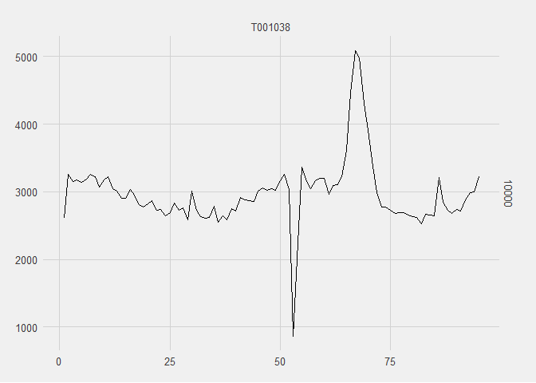

<!-- README.md is generated from README.Rmd. Please edit that file -->

# CoronaWatchNL

<!-- badges: start -->

[](https://www.tidyverse.org/lifecycle/#experimental)
[](https://CRAN.R-project.org/package=CoronaWatchNL)
<!-- badges: end --> CoronaWatchNL is an R package that allow you to
have access to a wide range range of Covid-19 data in the Netherlands.
This package mainly uses data that is collected and released by the
CoronaWatchNL repository on Github. However, it also provides more
datasets that are not included in that repository such, weekly mortality
rate.

At the moment, the following category of datasets can be accessed via
this package:

### Geographical datasets

| Dataset                                             | Source | Variables                                                                                                | Function                                                                           |
| --------------------------------------------------- | ------ | -------------------------------------------------------------------------------------------------------- | ---------------------------------------------------------------------------------- |
| Reported case counts by date in NL                  | RIVM   | Date, Type (Total, hospitalized and deceased COVID-19 cases), (Cumulative) Count                         | `get_daily_national_cases()`                                                       |
| Reported case counts by date in NL per province     | RIVM   | Date, Province, Type (Total, hospitalized and deceased COVID-19 cases), (Cumulative) Count               | `get_daily_provincial_cases()`                                                     |
| Reported case counts by date in NL per municipality | RIVM   | Date, Municipality, Province, Type (Total, hospitalized and deceased COVID-19 cases), (Cumulative) Count | `get_daily_cases_per_municpality`()/`get_cumilative_cases_per_municpality()`\#\#\# |

### Descriptive datasets

| Dataset                                          | Source | Variables                                                                                   | Function                          |
| ------------------------------------------------ | ------ | ------------------------------------------------------------------------------------------- | --------------------------------- |
| Case counts in NL per age                        | RIVM   | Date, Age group, Type (Total, hospitalized and deceased COVID-19 cases), (Cumulative) Count | `get_cases_by_age()`              |
| Case counts in NL per sex                        | RIVM   | Date, Sex, Type (Total, hospitalized and deceased COVID-19 cases), (Cumulative) Count       | `get_cases_by_sex()`              |
| Deceased case counts in NL per sex and age group | RIVM   | Date, Age group, Sex, (Cumulative) Count of deceased cases                                  | `get_deceased_cases_by_sex_age()` |

### Intensive care datasets

| Dataset                                                                | Source         | Variables                                                                                                                                                                | Function                                     |
| ---------------------------------------------------------------------- | -------------- | ------------------------------------------------------------------------------------------------------------------------------------------------------------------------ | -------------------------------------------- |
| COVID-19 intensive care patient counts in NL (Wide or long Format)     | Stichting NICE | Date, New, Total and Cumulative ICU admissions per day, Number of ICUs with at least one COVID-19 case, New and Cumulative fatal, survived and discharged ICU admissions | `get_icu_data_wide()`/ `get_icu_data_long`() |
| COVID-19 intensive care patient counts with country of hospitalization | LCPS           | Date, Country of Hospitalization, Total COVID-19 ICU admissions                                                                                                          | `get_lcps_data()`                            |

### Mortality Rate

## Installation

You can install the development version of CoronaWatchNL from
[GitHub](https://github.com/) with:

``` r
# install.packages("devtools")
devtools::install_github("mcnakhaee/CoronaWatchNL")
```

## Example

This is a basic example which shows you how to solve a common problem:

``` r
library(CoronaWatchNL)
library(tidyverse)
#> Warning: package 'tidyverse' was built under R version 3.6.3
#> -- Attaching packages -------------------------------------------------------------- tidyverse 1.3.0 --
#> v ggplot2 3.3.2     v purrr   0.3.3
#> v tibble  3.0.1     v dplyr   1.0.2
#> v tidyr   1.0.2     v stringr 1.4.0
#> v readr   1.3.1     v forcats 0.4.0
#> Warning: package 'ggplot2' was built under R version 3.6.3
#> Warning: package 'tibble' was built under R version 3.6.3
#> Warning: package 'dplyr' was built under R version 3.6.3
#> -- Conflicts ----------------------------------------------------------------- tidyverse_conflicts() --
#> x dplyr::filter() masks stats::filter()
#> x dplyr::lag()    masks stats::lag()
library(ggthemes)
#> Warning: package 'ggthemes' was built under R version 3.6.3
## basic example code
```

What is special about using `README.Rmd` instead of just `README.md`?
You can include R chunks like so:

``` r
mortality_rate <- get_mortality_rate()
#> Parsed with column specification:
#> cols(
#>   Sex = col_character(),
#>   `Age, 31 December` = col_character(),
#>   Periods = col_character(),
#>   `Deaths (aantal)` = col_double()
#> )
mortality_rate %>% 
  filter(!Periods %in% c('2017','2018','2019'),Sex!="Total male and female") %>% 
  ggplot(aes(x = seq_along(Periods),y = Death_count)) +
  geom_line() +
  facet_grid( Age_group~Sex) +
  theme_fivethirtyeight()
```


